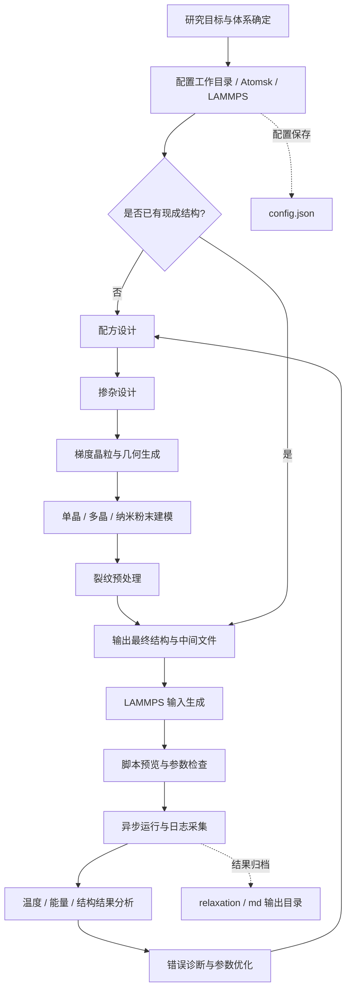

# DDOJY 高/中熵合金设计器汇报讲稿

## 汇报主线

1. 为什么要做这个软件
2. 软件如何构建
3. 软件使用了哪些方法
4. 软件的亮点是什么
5. 实际使用流程是什么
6. 结语

## 开场

各位老师、各位同学，大家好。今天我汇报的题目是《DDOJY 高/中熵合金设计器的软件构建、核心方法与使用流程》。这款软件面向高熵合金、中熵合金以及相关多晶、单晶和裂纹模拟场景，把配方设计、掺杂设置、梯度晶粒生成、结构建模、裂纹预处理、输出组织和 LAMMPS 模拟入口整合到一个统一界面中。

它要解决的是材料研究里步骤分散、参数繁多、文件来回切换、脚本容易出错等问题。我们的目标不是再做一个孤立的工具，而是做一个可视化、可复用、可追踪的完整工作流。

## 科研流程图

这张流程图对应的是实际科研使用闭环：从研究目标出发，先完成环境配置，再根据是否已有现成结构决定是直接进入模拟，还是从配方、掺杂、几何、建模、裂纹一路生成到最终结构，随后进入 LAMMPS 输入生成、运行、日志分析和结果迭代。它的核心特点是前处理、模拟和后处理串成了一条连续链路，减少了人工切换和文件混乱。

## 一、为什么要做这个软件

在实际的高/中熵合金研究中，常见流程通常包括元素配方设定、几何结构生成、掺杂与缺陷引入、裂纹预处理、LAMMPS 输入脚本生成以及后续的动力学模拟。传统做法往往要在多个脚本、多个文件夹和多个软件之间反复切换，既费时，也容易因为路径、参数或格式不一致而出错。

DDOJY 的设计思路，就是把这些步骤尽量收敛到一个界面中，让用户可以按顺序完成工作，并且随时看到当前结果是否正确。这样做的价值不只是省一步，而是把材料建模流程变成一个可检查、可回退、可复现的过程。

## 二、软件如何构建

### 1. 技术栈与界面框架

软件主体使用 Python 构建，界面层采用 Tkinter 和 ttk，结果绘图使用 Matplotlib，文件路径和中间文件管理主要依赖 pathlib、subprocess 和 dataclass。界面部分按照工作流拆分成多个功能页，包括工作台、配方、掺杂、晶粒、建模、裂纹、输出、LAMMPS 接口以及教程与帮助页。

为了避免内容过多时被截断，页面中大量使用了 ScrollableFrame 和 ScrolledText，这样即使在笔记本屏幕上也能完整浏览。

### 2. 数据与配置分层

程序启动后，会先读取 config.json，恢复工作目录、LAMMPS 可执行文件、核数、GPU 选项和最近使用的场景等信息。这样用户下次打开时无需重新配置。

核心参数没有写死在界面里，而是用多个数据类统一承载，例如配方、掺杂、几何、裂纹和 LAMMPS 输入配置分别有独立的数据结构。这样做的好处是，界面只负责收集和显示参数，真正的计算、生成和写文件逻辑可以独立维护，后续扩展也更安全。

### 3. 外部工具联动

这个软件不是封闭系统，它和 Atomsk、LAMMPS 进行联动。Atomsk 主要负责几何生成、结构转换和多晶源文件创建，LAMMPS 负责后续模拟。程序可以识别环境目录、python.exe 或 lmp.exe，并将它们解析为可用的 LAMMPS 运行时。

对于 .cfg 和 .xsf 这类源文件，软件会先借助 Atomsk 转成临时 LAMMPS 文件，再继续后续流程。这种设计保证了工具链的兼容性，也便于打包部署。

### 4. 资源组织与部署方式

软件把资源按 data、models、docs 分类，兼容源码运行和打包后的 exe 运行。教程与帮助页不是另放网页，而是直接内嵌到软件里，用户在界面中就能查看完整说明。最终发布时通过 PyInstaller 打包，适合实验室内部共享，也适合给没有开发环境的同事直接使用。

## 三、核心方法是什么

### 1. 模板驱动的输入生成

LAMMPS 输入并不是固定拼写的，而是通过模板替换生成。默认模板里预留了数据文件、输出目录、势函数、场景段、附加命令和输出路径等占位符。用户切换不同场景时，程序会自动替换对应段落；如果选择自定义场景，附加命令甚至可以直接作为完整运行块使用。

这种方式把“写脚本”变成了“填模板”，既保留灵活性，也减少了手工改错的概率。

### 2. 事件驱动和参数联动

界面中大量使用 StringVar 和 BooleanVar 以及回调联动机制。比如切换裂纹形状时，参数标签会自动从“长度/开口宽度”变成“长轴/短轴”，切换裂纹方向时，边缘位置选项也会自动更新。

这样做的本质是让界面和参数保持同步，减少用户在不同控件之间手动对齐的负担，也降低了因为标签和真实含义不一致而造成的误操作。

### 3. 几何预览和可视化校验

在梯度晶粒页，程序基于 Voronoi 思路生成节点和晶粒布局，并提供摘要、节点 CSV 和研究报告导出。建模页把二维多晶、三维多晶、纳米粉末和单晶统一到可视预览中。

裂纹页使用 Canvas 做实时预览，前端可以在矩形和椭圆或圆之间切换，后端则按相应数学区域删除原子。也就是说，用户看到的预览和最终生成的结果是一致的，这对材料建模来说非常重要。

### 4. 结果解析和稳定性控制

LAMMPS 运行结束后，软件会自动轮询日志文件，解析热力学结果并绘制温度、能量等曲线。如果日志里出现 lost atoms、dangerous builds、out of range atoms 这类常见问题，程序会给出诊断提示。

与此同时，在生成最终结构前，还会清理过近的原子对，尽量降低后续失稳的风险。这体现的是一种“前处理校验加后处理诊断”的稳定性思路。

### 5. 附加命令的设计方法

在 LAMMPS 接口页里，附加命令的作用尤其重要。它适合放一些你希望插入到脚本中的自定义 LAMMPS 语句，例如 group、region、delete_atoms、create_atoms、set 等操作。

普通场景下，它会作为场景段前的补充内容；如果选的是 Custom 场景，它还可以直接作为整段运行块来使用。也就是说，附加命令既能用来做局部修补，也能用来做完整自定义流程。

## 四、这个软件的亮点在哪里

1. 一体化工作流：用户可以从配方、掺杂、晶粒、建模、裂纹一路做到输出和 LAMMPS 运行，不需要频繁切换软件或手工拼接文件。
2. 可视化和即时反馈：每个关键步骤都有预览、摘要或结果图，参数变更后界面会同步刷新，能尽早发现问题。
3. 高级定制能力：场景模板、pair_style 和 pair_coeff 覆盖、自定义模板、附加命令输入都可以直接编辑，既适合新手，也适合高级用户。
4. 稳定性和可迁移性较好：工作目录、运行时和最近场景都能保存，源码和 exe 两种方式都能用，降低了部署门槛。
5. 面向科研流程：软件不仅生成模型，还考虑了日志诊断、输出组织、继续接续数据、教程帮助和错误提示，属于完整的研究型工具。

## 五、实际怎么用

1. 启动与初始化：先运行启动脚本，设置工作目录和 LAMMPS 环境。
2. 配方设置：在配方页输入元素组成，确定合金体系。
3. 掺杂设置：在掺杂页添加置换、空位、表面吸附或间隙插入。
4. 梯度晶粒生成：在梯度晶粒页设置模型尺寸、晶粒大小、层数和排布方式。
5. 结构建模：在建模页选择二维多晶、三维多晶、纳米粉末或单晶。
6. 裂纹预处理：如果需要断裂研究，就在裂纹页选择中心裂纹或边缘裂纹，并设定形状和尺寸。
7. 输出与模拟：到输出页或 LAMMPS 接口页生成最终文件并运行模拟。
8. 一键生成全部：对于更复杂的情形，还可以点击一键生成全部，把几何、裂纹、掺杂和合金配方一次串起来。

如果研究重点只是已有结构的后续模拟，也可以直接在 LAMMPS 接口页完成输入生成、脚本预览和运行，不必重新走完整建模流程。

## 六、适合汇报时强调的几个关键词

- 模块化：每个功能页独立，职责清晰。
- 模板化：LAMMPS 输入通过模板生成，易于统一和复用。
- 可视化：预览、图表和教程页帮助用户快速校验参数。
- 自动化：配置恢复、场景填充、输出组织和日志解析都尽量自动完成。

如果时间有限，汇报时可以重点强调这四个词，因为它们最能概括这款软件的设计思路。

## 七、结语

总的来说，DDOJY 高/中熵合金设计器不是一个单点工具，而是一套围绕材料研究流程构建的软件系统。它把数据结构、模板生成、几何预览、外部工具联动和结果诊断整合到一起，真正实现了从“会写脚本”到“会用工具”的转变。

对科研人员来说，它降低了上手成本；对重复实验来说，它提高了效率；对后续扩展来说，它也保留了足够的弹性。我的汇报到这里结束，谢谢大家。

## 讲演提示

如果用于组会汇报，可以按“背景 - 构建 - 方法 - 亮点 - 用法 - 结语”的顺序讲，逻辑会比较清晰。如果用于答辩，可以把“附加命令怎么用”“日志诊断怎么做”“裂纹和预览怎么联动”作为补充重点。
